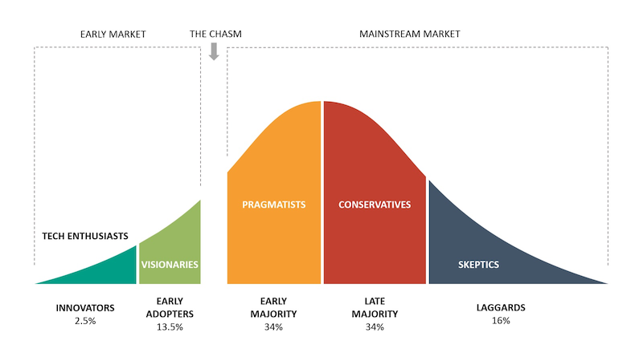

I've personally made the jump recently from Twitter to Mastodon/the [Fediverse](https://en.wikipedia.org/wiki/Fediverse) after one too many blunders from our Mars obsessed overlord.

After jumping ship, I've become much more curious towards the inner workings of [ActivityPub](https://en.wikipedia.org/wiki/ActivityPub),
the protocol enabling isolated social media servers to share content.
([Mastodon](https://en.wikipedia.org/wiki/Mastodon_(social_network)), Pleroma, [PixelFed](https://en.wikipedia.org/wiki/Pixelfed), etc all implement this protocol)

Honestly, I love the idea of the Fediverse & do believe it's likely that this strategy of allowing online identities & followers to move around between services will be the future.

My mind has been a-buzz with ideas of what the future might hold here,
I've also been looking for little gaps in the current offerings (It's Christmas holidays and I'm bored, any excuse to code up a new web-service)

While I haven't built anything within the Fediverse yet, I have been watching as others have the same idea and the community response has surprised me.

We are still very much sitting on the 'Early market' side of _'the chasm'_, many active members are enthusiasts with strong opinions around how this platform should evolve.

There are many discussions about whether some features should/shouldn't be implemented. For example: 'quote tweeting'. [Eugen Rochko, The lead developer of Mastodon has said](https://mastodon.social/@Gargron/99662106175542726)
> I've made a deliberate choice against a quoting feature because it inevitably adds toxicity to people's behaviours. You are tempted to quote when you should be replying, and so you speak at your audience instead of with the person you are talking to. It becomes performative. Even when doing it for "good" like ridiculing awful comments, you are giving awful comments more eyeballs that way. No quote toots. Thank's

This is totally reasonable, it's his software and this reasoning is fair. However, the reality is that _someone_ will inevitably create an ActivityPub compliant
server that does support quote posts, and the protocol will either adapt to support this formally or extensions will be used to represent quote posts.

This is where the community response has surprised me, half the benefit of this protocol based social media system is no vendor lock in,
anyone can create a better Twitter/Instagram/YouTube and users can switch or not, without losing their followers & flow of content.

**However the idea of someone coming along and creating an [anonymous follow service](https://mastinator.com/) or a [fediverse search engine](https://fedisearch.io/) has [made people angry](https://mastodon.ar.al/@aral/109585159213960986)**

`#FediBlock` and other community dependent mass-blocking solutions are not a scalable solution to keeping the Fediverse from evolving.

These systems can be built, and they will be built as time goes on. Luckily I haven't seen many, if any bad faith actors building malicious services on ActivityPub, but that too will happen, and we need to be ready.

If you post it on the Fediverse, it's public content, there is no concept of private. Even 'followers only' and private messages are being sent to servers outside of your control.

Public content will, with time, become indexed searchable content. With time there will be big players in the fedi search space, and likely advertising, and likely they will respect the community as existing search players more or less do.
But there is very little we can do with an open, public-first protocol, to prevent posts being viewed by external services.

If this is unacceptable to you, maybe a fully-federated, public social network isn't what you want. It's possible to run Mastodon with federation completely disabled to create a private network.

I hope with time we become more accepting of experimental Fediverse related projects. Eventually search will exist, some platforms may support quote posting, others may not.
This is a huge opportunity for new ways of communicating to be trialed, the barrier to entry for an alternate player is much lower now that users exist on all platforms simultaneously,
let's not squash that opportunity by piling hate on every new project created because it's different to the way we would like things run.

Anyway if I haven't offended you follow me at [@jyelewis@fosstodon.org](https://fosstodon.org/@jyelewis)
